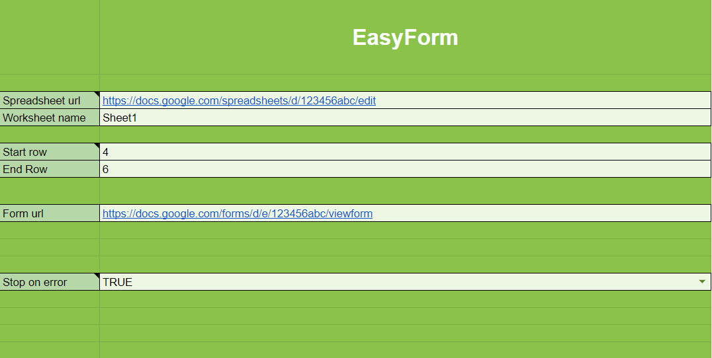

# EasyForm
EasyForm is a tool made with Google Apps Script for automatically upload rows from a Google Sheet to any Google Form.

Spreadsheet with script:

https://docs.google.com/spreadsheets/d/1rrhUXSuYQ5wEnSNlawoMtjulsr6XBKVGbMmWgpU7-M0/copy

It supports every type of Google Form question, which include:
- Short Answer
- Paragraph
- Multiple Choice
- Checkboxes
- Dropdown
- Linear Scale
- Multiple choice grid
- Checkbox grid
- Date
- Time

This tool only works with Google Forms that don't require a login access with a Google account.

## Usage

### Worksheets

#### Settings

Contains all settings about the tool:
- Spreadsheet url: the target spreadsheet which contains the worksheet with the rows to upload in the Form
- Worksheet name: the worksheet name inside the spreadsheet file to be used
- Start row: the start row number of the rows to upload (Need to be at least 2 because the first row is reserved for the header names)
- End row: the last row number of the rows to upload
- Stop on error: if TRUE the script will stop its execution when the first error occurs, if FALSE it will continue until reaching the end row specified

#### Form Questions

Used for display all the Form questions. The column are:
- Question: the form question title
- Column to use: contains a dropdown with all the header names of the worksheet selected in the settings (the header names must be in the first row)
- Required: contains a "X" if the form question is required
- Use custom value: if checked for that question it will be used a custom value instead of our data
- Custom value: specify the custom value to use

